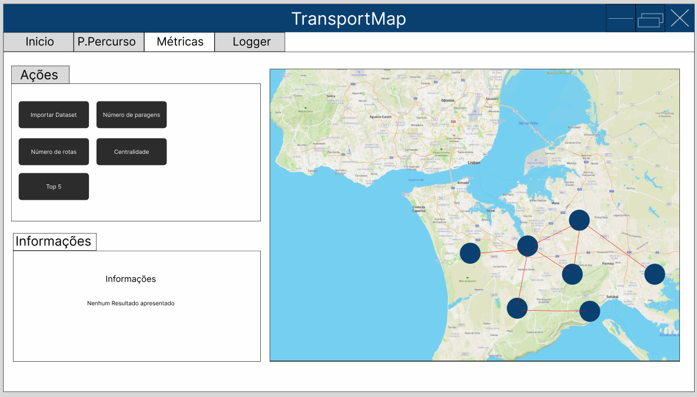
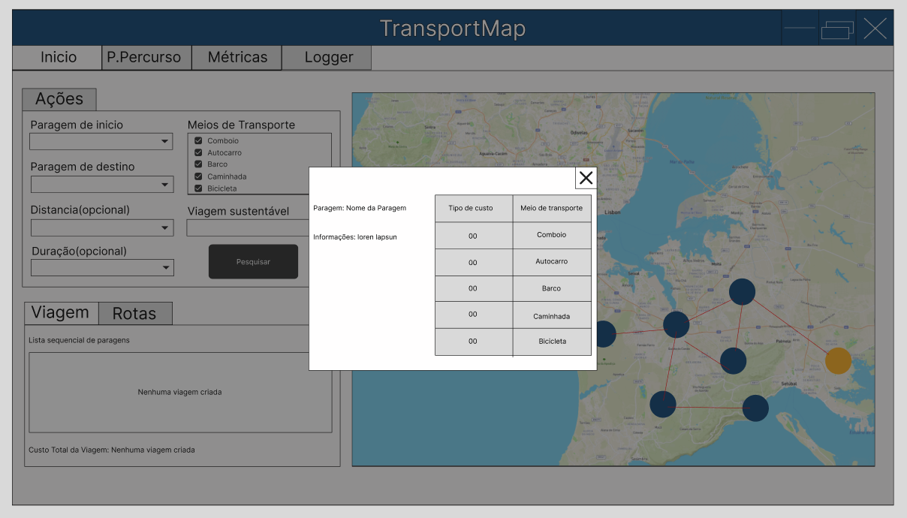
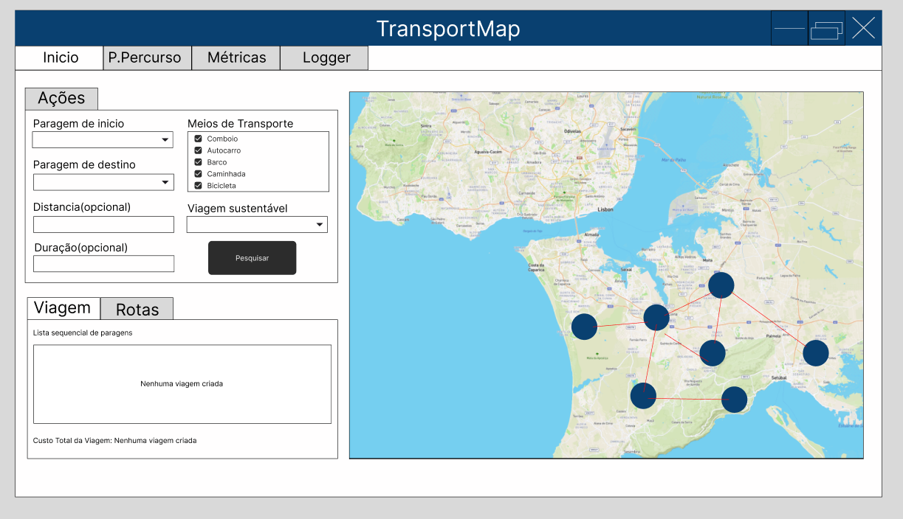
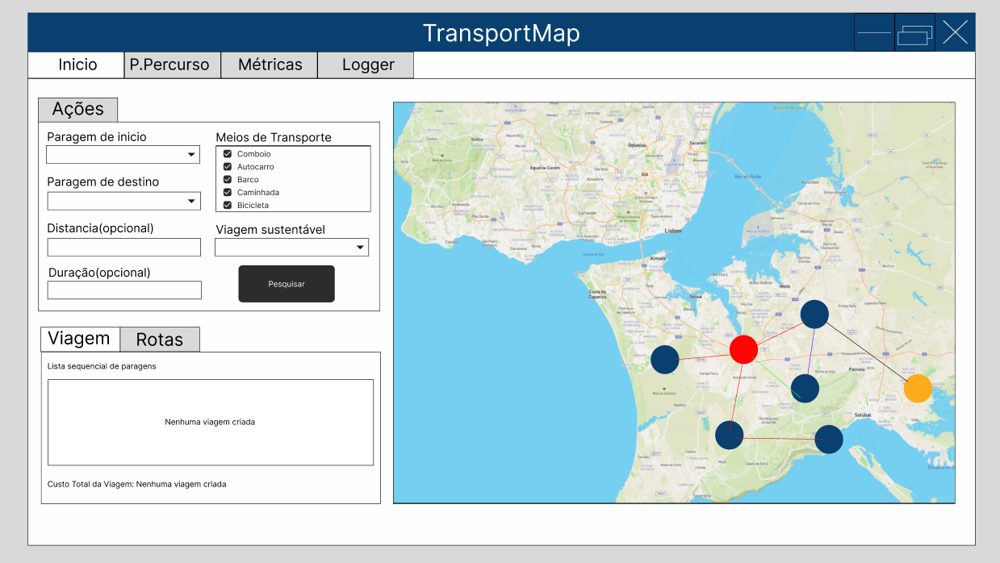
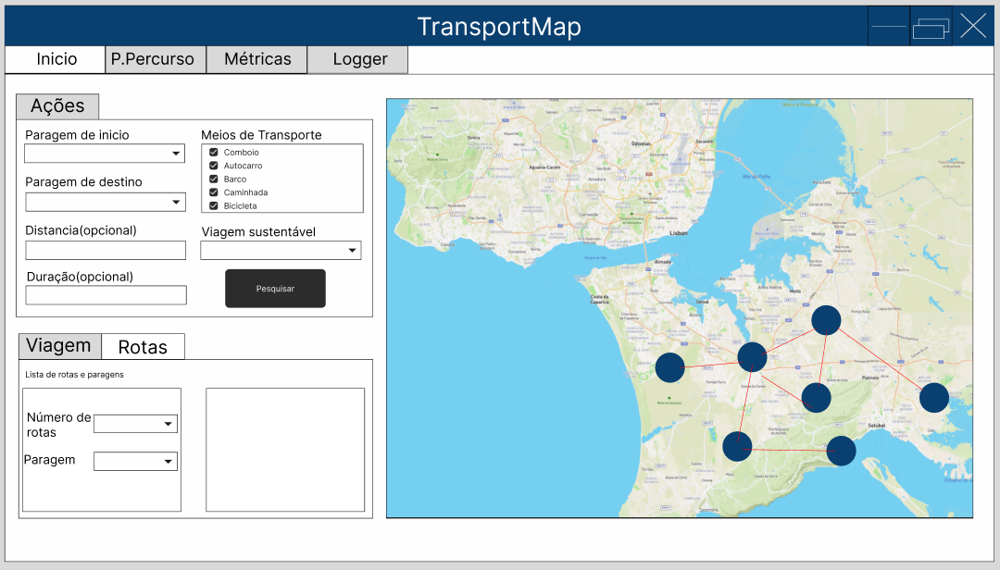
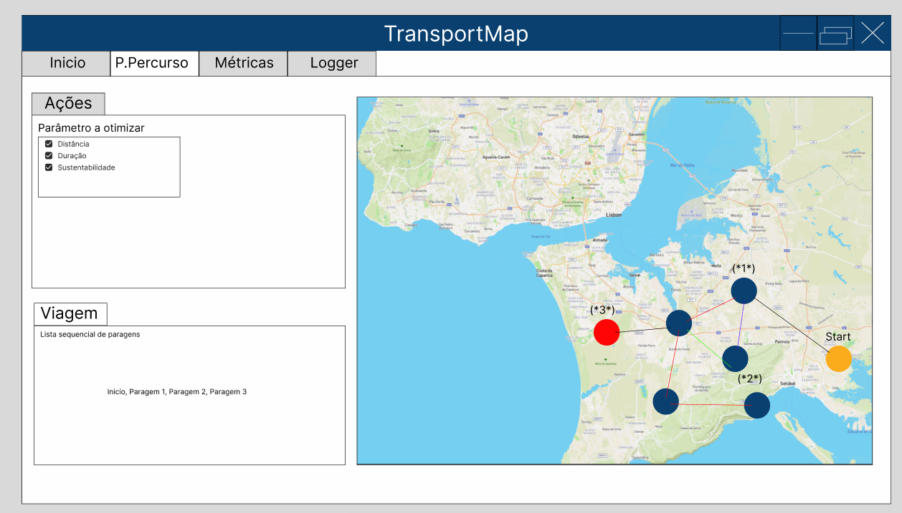
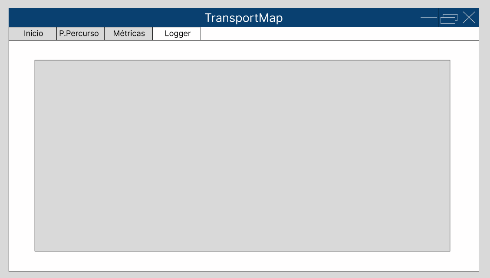

# Projeto Programação Avançada 2024/25 - Época Normal

# Introdução

Um sistema integrado de transportes corresponde a um conjunto coordenado de diferentes meios de transporte, interligados de maneira eficiente, para facilitar a deslocação de pessoas ao longo da rede.

Este programa tem como objetivo a utilização de uma estrutura de dados adequada para representar e armazenar a informação deste sistema de transportes. Permite também através de uma interface gráfica a visualização de rotas de transportes existentes e personalizáveis com o objetivo de ajudar o utilizador a ir até ao seu destino da forma que preferir dependendo dos seus requisitos para a viagem.

# Dependências

O projeto tem as seguintes bibliotecas importadas a partir do Maven:

- JUnit 5.8.1
- SmartGraph 2.0.0
- OpenCSV 5.9
- BellSoft Liberica JDK (Java Development Kit), versão 17 LTS (FULL), com suporte para JavaFX

# Membros do Grupo

Este trabalho foi realizado por:

- Diogo Pinheiro - 202100729
- José Oliveira - 202300558
- Tiago Campos - 202300064

# Detalhes sobre a estrutura de dados concebida

A rede de transportes tem subjacente um grafo como estrutura de dados que guarda as informações das estações dos transportes `(Stop)` e as informações dos percursos entre as estações `(Route)`. 

Este programa só apresenta uma única rede de transportes `(TransportMap)` pelo que este é implementado usando o método de desenho `Singleton`, só permitindo existir uma única instância desta rede/mapa de transportes.

# Resumo do trabalho e do código desenvolvido

O trabalho desenvolvido envolveu a criação do design utilizando `JavaFX`, bem como a importação e tratamento de dados de três ficheiros CSV denominados: 

`stops.csv`, `xy.csv` e `routes.csv`

Estes ficheiros contêm as informações necessárias para a criação do nosso grafo. Através deles, conseguimos posicionar os vários vértices, denominados `Stops`, e estabelecer as suas ligações através de arestas chamadas de `Routes`.

Com isto, criamos um grafo que, ao ser enviado para a classe `MapView`, nos permite obter o resultado esperado: um mapa com várias paragens de transportes públicos interligadas numa rede.

Enquanto o código ia sendo criado, iam por sua vez sendo criados os testes para executar os métodos necessários, sendo que utilizamos o `JUnit`como ferramenta para a execução de testes unitários.

# Mockup

Nas imagens apresentadas em baixo é mostrado o mockup da interface gráfica idealizada para a aplicação sendo o mesmo efetuado na aplicação [Figma](https://www.figma.com/).

Estes estão divididos em diferentes páginas, cada uma com uma breve descrição das funcionalidades presentes conforme especificadas no enunciado do projeto.

## Página de Métricas

Na imagem em baixo é possível visualizar o mockup da interface que permite visualizar as métricas correspondente aos pontos 3.1.1. e 3.1.2. do enunciado (pontos 1 a 5, inclusive, na divisão de trabalhos).

Figura 1 - Página de Métricas.

### Requisitos implementados

O ponto 3.1.1. (ponto 1 na divisão de trabalhos):

- Permitir a importação do dataset do sistema integrado de transportes.
- Gerar e exibir o modelo correspondente em forma de grafo.

O ponto 3.1.2. (pontos 2 a 5 na divisão de trabalhos):

- **Número de paragens**: Mostrar total, isoladas e não isoladas.
- **Número de rotas**: Exibir total de rotas e possíveis rotas por tipo de transporte.
- **Centralidade das paragens**: Lista decrescente de paragens com base no número de adjacências.
- **Top 5 paragens mais centrais**: Gráfico de barras destacando as cinco paragens com maior centralidade.

## Página de Início

### Custo de rotas

Na imagem em baixo é possível visualizar o mockup da interface da página de início que corresponde ao ponto 3.1.3.

Figura 2 - Página de Início com visualização do custo das rotas numa tabela.

São implementados os requisitos do ponto 3.1.3. (ponto 6 na divisão de trabalhos):

- Permitir consulta detalhada de uma paragem ou rota por meio de duplo clique na mesma.
- Exibir custos das rotas em uma tabela, organizada por tipo de custo e meio de transporte (Esquerda: Tipo de custo | Topo: Meio de transporte).

### Lista sequencial de paragens

Na imagem em baixo é possível visualizar o mockup da interface do inicio que corresponde ao ponto 3.1.4.

Figura 3 - Página de Início com visualização da lista sequencial de paragens e o seu custo. É possível selecionar os critérios para determinação da rota.

São implementados os requisitos do ponto 3.1.4. (pontos 7 e 8 na divisão de trabalhos):

- Implementar funcionalidade para calcular o percurso de menor custo entre duas paragens, com critérios de otimização como distância, duração ou sustentabilidade fornecidos pelo utilizador.
- Permitir seleção de meios de transporte e exibir rota otimizada com custos totais baseados nos parâmetros fornecidos, sendo a mesma apresentada como uma lista sequencial de paragens e o seu custo sendo calculado.

### Visualização de rotas

Na imagem em baixo é possível visualizar o mockup da interface do inicio que corresponde ao ponto 3.1.5.

Figura 4 - Página de Início com visualização das rotas com cores diferentes consoante o meio de transporte.

São implementados os requisitos do ponto 3.1.5 (ponto 9 na divisão de trabalhos):

- Exibir visualmente os percursos no grafo com base nos critérios de análise (distância, duração ou sustentabilidade) e nos meios de transporte selecionados.
- Destacar rotas com cores diferentes para cada meio de transporte, atualizando a visualização com cada nova análise.

### Consulta de paragens que distam até *n* rotas de uma paragem

Na imagem em baixo é possível visualizar o mockup da interface do inicio que corresponde ao ponto 3.1.6.

Figura 5 - Página de Início com consulta de paragens que distam até *n* rotas de uma paragem dada.

São implementados os requisitos do ponto 3.1.6 (ponto 10 na divisão de trabalhos):

- Permitir consulta de paragens que distam até *n* rotas de uma paragem especificada pelo utilizador *e*, com *n* e a paragem inicial selecionados pelo utilizador.

## Página de Personalizar o Percurso

Na imagem a baixo é possível visualizar o mockup da interface personalizar percurso que corresponde ao ponto 3.1.7.

Figura 6 - Página de Personalizar o Percurso, permitindo o utilizador definir um percurso personalizado.

### Requisitos implementados

O ponto 3.1.7. (ponto 11 e 12 na divisão de tarbalhos):

- A aplicação deve permitir que o utilizador defina um percurso personalizado, especificando a sequência de paragens que o compõem e os seus parâmetros de otimização (distância, duração ou sustentabilidade).

## Página de Logger

Na imagem em baixo é possível visualizar o mockup da interface do inicio que corresponde ao ponto 3.1.8

Figura 7 - Página de Logger onde é possível visualizar o histórico de acções realizadas pelo utilizador.

### Requisitos implementados

O ponto 3.1.8. (ponto 13 na divisão de trabalhos):

- Permitir consulta das operações realizadas pelo utilizador.
